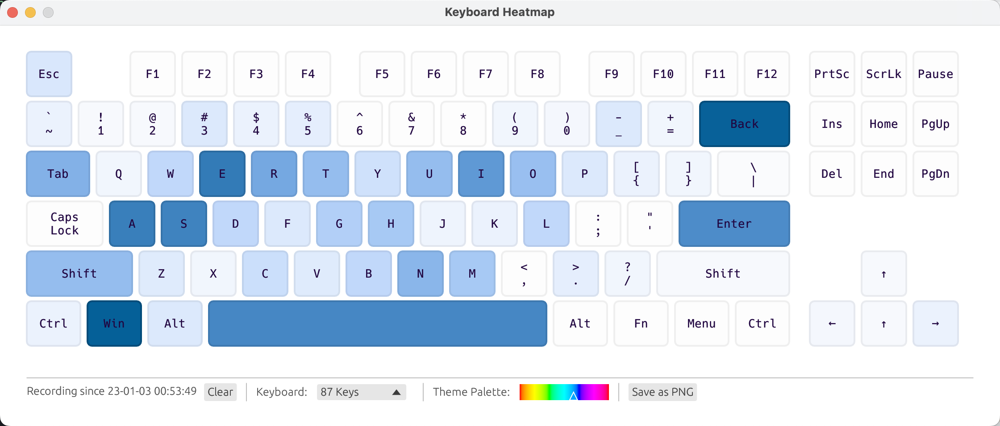

# keyboard-heatmap

[English](./README.md) | [简体中文](./README-zh.md)
<h3 align="center">为你的键盘使用分布生成热力图</h3>

## 使用

在 release 下载，或者在源码目录 `cargo run`

## 支持的键盘布局
- [x] MacBook Pro 美式布局

- [x] Qwerty 87 键美式布局（有控制键区）

- [ ] Qwerty 104 键美式布局（有小键盘）
